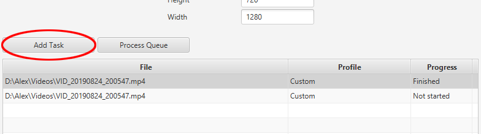
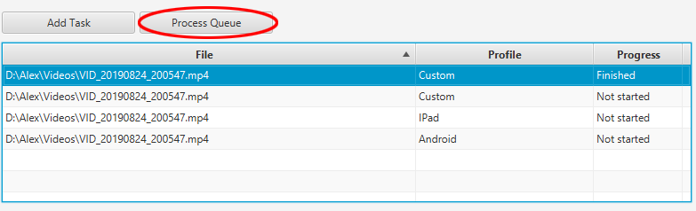

Projektbeschreibung
===================

Es wurde eine Desktop-Applikation entwickelt, mit der man Videos
konvertieren und komprimieren kann. Diese Anwendung ist für
Einzel-Benutzer gedacht und unterstützt die einfache Umwandlung von
Video-Dateien in alle gängige Formate.

Outline
-------

-   Die Anwendung verwendet im Hintergrund [FFmpeg](https://ffmpeg.org/)

-   Die GUI ermöglicht es alle gängigen Einstellungen vorzunehmen,
    woraufhin die Verarbeitung des Videos mit den jeweiligen getroffenen
    Optionen durchgeführt wird.

-   Es gibt vordefinierte Profile, die optimierte Einstellungen für
    Android Handy sund Iphones angeben. Weiters können
    benutzerdefinierte Profile auch selber angelegt, gespeichert und
    verändert werden.

-   Es ist möglich, mehrere Aufträge in einer Warteschlange abzulegen,
    die z.B. über die Nacht verarbeitet werden. Ein Auftrag besteht aus
    einem Video und bestimmten Einstellungen, mit denen es verarbeitet
    werden soll. Der Benutzer kann jederzeit neue Aufträge zu der
    Warteschlange hinzufügen/ entfernen/ stoppen etc.

Die Anwendung ermöglicht:
-------------------------

-   Der Benutzer kann mittels der GUI ein Video von einem Format zu
    einem anderen Konvertieren.

-   Der Benutzer kann eine Warteschlange erstellen, in der zu jedem
    Video Einstellungen definiert sind, die über einen längeren Zeitraum
    verarbeitet werden.

-   Der Benutzer kann per Drag&Drop oder durch Pfadauswahl Video-Dateien
    spezifizieren.

-   Der Benutzer kann alle Tasks in der Warteschlange jederzeit stoppen
    und beliebige entfernen.

-   Der Benutzer kann für jeden Task einen Zielordner angeben, wo das
    verarbeitete Video gespeichert wird.

-   Der Benutzer kann Profile erstellen, in denen Einstellungen
    gespeichert werden können.

-   Der Benutzer kann diese Profile auch bearbeiten/ entfernen etc.

-   Dem Benutzer werden ein paar optimierte Profile für bestimmte
    Plattformen (z.B. für Android) bereitgestellt, die er zum Video
    verarbeiten verwenden kann

-   Der Benutzer kann Audiospuren aus dem Video entfernen/ neue
    hinzufügen.

Die Anwendung ermöglicht NICHT:
--------------------------------

-   Der Benutzer kann **nicht** mittels des Tools Videos
    zusammenschneiden.

-   Der Benutzer kann **keine** Videos bearbeiten (z.B. neue Animationen
    hinzufügen).

Das Projekt wurde in JAVA realisiert und für die GUI wurde
[JavaFX](https://openjfx.io/) benutzt. Um die Kommunikation zwischen
FFmpeg und dem Programm zu realisieren wurde der
[ffmpeg-cli-wrapper](https://github.com/bramp/ffmpeg-cli-wrapper)
verwendet. Die Profile werden in einer
[SQLite-Datenbank](https://www.sqlite.org/index.html) lokal auf dem
Rechner gespeichert und sind auch importierbar / exportierbar. Zur
Versionskontrolle und gemeinsamen Zusammenarbeit wurde GitHub verwendet.

Implementierung
===============

GUI
---

Die GUI wurde in [JavaFX](https://openjfx.io) mithilfe von
[SceneBuilder](https://gluonhq.com/products/scene-builder/) gestaltet.
Es wurde ein Hauptaugenmerk darauf gelegt, dass die verschiedenen
Bereiche/Einstellungen vernünftig gruppiert und gegliedert werden, und
dass die GUI gut auf Resize-Operation anspricht. Die GUI in der finalen
Version sieht folgendermaßen aus:

![Der finale GUI Entwurf[]{label="guifinal"}](images/gui.png)

### Fenstergröße

Die GUI hat eine Standard- und Minimumgröße von 800x600 (width x
height). Auszug aus der main.java Datei:

    primaryStage.setMinHeight(600);
    primaryStage.setMinWidth(800);
    mainScene = new Scene(root, 800, 600);

### Alignment

Die Hauptkomponente der GUI ist eine VBox. In dieser VBox befinden sich
der Reihe nach folgende Komponenten:

-   Ein BorderPane mit dem Label „File Options" als Center-Komponente

-   Ein BorderPane mit dem Label „Input File" als Left-Komponente, einem
    Textfeld für den Pfad der Input Datei als Center-Komponente, und
    einem Browse-Button welcher einen FileChooser öffnet als
    Right-Komponente.

-   Ein BorderPane mit dem Label „Output File" als Left-Komponente,
    einem Textfeld für den Pfad des Output Ordners als
    Center-Komponente, und einem Browse-Button welcher einen
    DirectoryChooser öffnet als Right-Komponente.

-   Ein BorderPane mit dem Label „Encoding Options" als Top-Komponente,
    und einem GridPane mit drei Spalten und einer Reihe als
    Center-Komponente. In diesem GridPane befinden sich drei
    BorderPanes, welche wiederum jeweils ein Überschrifts-Label als
    Top-Komponente, und ein 6x2 GridPane als Center-Komponente besitzen.
    In der linken Spalte dieser GridPanes befindet sich jeweils die
    Bezeichnung der Einstellung, welche man in der rechten Spalte
    auswählen/spezifizieren kann.

-   Eine einfache HBox mit zwei Buttons: Add Task (fügt den Task zu der
    TableView hinzu falls eine gültige Input-Datei ausgewählt wurde) und
    Process Queue (arbeitet die Tasks in der TableView der Reihe nach
    ab)

-   Eine TableView in der die aktiven Tasks gelistet werden.

-   Eine weitere einfache HBox mit drei Buttons: Start selected task
    (startet den ausgewählten Task wenn möglich), Remove selected task
    (entfernt den ausgewählten Task aus der TableView wenn möglich), und
    Remove all finished tasks (entfernt alle bereits beendeten Tasks aus
    der TableView)

### Horizontales Vergrößern/Verkleinern

Hier wird nur die Breite der folgenden Komponenten verändert:

-   Die Überschrifts-Labels „File Options" und „Encoding Options",
    sodass sie sich auch nach der Resize-Operation noch in der Mitte
    befinden. Dies wird von den BorderPanes selbst realisiert, welche
    die Breiten von Top-, Center-, und Bottom-Komponenten automatisch
    anpassen.

-   Die Textfelder für die Input-Datei und den Output-Ordner. Die
    Browse-Buttons und die Labels bleiben unverändert. Dies wird
    ebenfalls von den BorderPanes selbst realisiert, welche die Breiten
    ihrer Left- und Right-Komponenten bei einem horizontalen Resize
    unverändert lassen.

-   Die jeweiligen Spalten der GridPanes. Dies wird ebenfalls
    automatisch von den BorderPanes realisiert.

-   Die TableView

### Vertikales Vergrößern/Verkleinern

Hier wird nur die Höhe der TableView verändert. Diese Funktionalität
wurde mithilfe der vgrow Eigenschaft realisiert. Allen Reihen der
GridPanes, allen BorderPanes, und allen HBoxes wurde die Eigenschaft
„vgrow="NEVER" zugewiesen. Als Beispiel, hier die Definition einer
GridPane-Reihe:

    <RowConstraints minHeight="10.0" prefHeight="30.0" vgrow="NEVER" />

Datenspeicherung
----------------

Die Daten werden mithilfe einer SQLite Datenbank gespeichert. Um diese
SQLlite Datenbank ansteuern zu können wurde der [sqlite-jdbc
Driver](https://github.com/xerial/sqlite-jdbc) verwendet.

### Aufbau der SQLite-Schnittstelle

Wenn das Programm gestartet wird, wird eine Verbindung zur Datenbank
hergestellt. Diese Verbindung bleibt bestehen solange das Programm
läuft. Dies hat den positiven Nebeneffekt, dass kein anderer Prozess auf
die Datenbank zugreifen kann während das Programm läuft, was zu
unerwünschten Fehlern führen könnte. Wenn keine Verbindung erstellt
werden konnte wird eine *ConnectionFailedException* geworfen.

      public static void openConnection() throws ConnectionFailedException {
        try {
          Class.forName("org.sqlite.JDBC");
            conn = DriverManager.getConnection(DB_URL);
            if (conn != null) {
              System.out.println("Connected to the database");
              DatabaseMetaData dm = conn.getMetaData();
              return;
            }
          } catch (ClassNotFoundException | SQLException ex) {
            ex.printStackTrace();
        }
        throw new ConnectionFailedException("Couldn't get a Connection to the Database");
      }

### Schema der Datenbank 

Die Datenbank wurde nach diesem Schema erstellt:

![Aufbau der Datenbank[]{label="schema"}](images/db_schema.png)

Die Datenbank beinhaltet alle angelegten Einstellungs-Profile
(Benutzerdefinierte und Allgemeine) sowie alle von FFmpeg akzeptierten
Formate und Codecs. Da SQLite keine Boolean Werte unterstützt, werden
stattdessen die Zahlen 0 und 1 verwendet. Die Daten werden beim
Importieren aus der Datenbank als jeweilige Objekte (Profile, Codec,
Format) instanziert und entweder als Liste oder als sortedSet an den
Controller übergeben.

### Profile

Profile beinhalten folgende Eigenschaften:

-   Audiocodec

-   AudioSampleRate

-   AudioBitRate

-   Videocodec

-   VideoFrameRate

-   VideoWidth

-   VideoHeight

-   Format

-   Outputpath

Die Profile werden beim Programmstart aus der Datenbank exportiert und
als HashMap an den Controller übergeben. Dies ist der dazugehörige Code,
wobei in der Methode `extractProfile(result)` aus den importierten Daten
ein Profil erstellt wird:

      public static Map<String, Profile> getAllProfiles() throws SQLException, NoSuchFieldException {

        Map<String, Profile> map = new HashMap<>();
        String sql = "SELECT * FROM Profiles";
        Statement statement = conn.createStatement();
        ResultSet result = statement.executeQuery(sql);

        while (result.next()) {
          Profile profile = extractProfile(result);
          map.put(profile.getName(), profile);
        }
        return map;
      }

### Codecs

Da es leider im CLI-Wrapper keine Möglichkeit gibt die Codecs und
Formate aus FFmpeg zu exportieren, musste improvisiert werden. Mittels
dem Befehl *ffmpeg -codecs* wurden die Codecs aus FFmpeg exportiert und
dann in eine Textdatei geleitet. Von dort konnten sie via Java
eingelesen und in die Datenbank eingefügt werden. In der folgenden
Grafik sieht man die Formatierung in der die Codecs vorliegen. An erster
Stelle stehen die Flags, dann die Codecbezeichnung und zum Schluss eine
Beschreibung.

![Export der
Codecs[]{label="ffmpeg-codecs"}](images/codecs.png)

Somit ergeben sich folgende Eigenschaften von Codecs die in die
Datenbank übernommen wurden:

-   Name

-   Beschreibung

-   Wichtigkeit(Integer)

-   Decoding(Boolean)

-   Encoding(Boolean)

-   CodecTyp(Audio, Video, Untertitel)

-   Intracodec(Boolean)

-   Lossy Compression(Boolean)

-   Lossless Compression(Boolean)

Die Besonderheit bei den Codecs ist, dass wir in unserer GUI Audiocodecs
und Videocodecs getrennt voneinander verwenden. Darum werden die Codecs
beim Import aus der Datenbank getrennt behandelt.Außerdem werden die
beiden Sondercodecs "copy" und "auto" beim Import eingefügt. Sie sind
somit nicht in der Datenbank festgehalten.

Es folgt die Implementierung des Imports der Videocodecs:

      public static SortedSet<Codec> getVideoCodecs() throws SQLException {
        SortedSet<Codec> set = new TreeSet<>(codecComparator);
        String sql = "SELECT * FROM AvailableCodecs WHERE CodecType=0";
        Statement statement = conn.createStatement();
        ResultSet result = statement.executeQuery(sql);
        while (result.next()) {
          Codec codec = extractCodec(result);
          set.add(codec);
        }
        set.add(new Codec("copy", 9));
        set.add(new Codec("auto", 10));
        return set;
      }

Beim Importieren der AudioCodecs wird dann der "CodecType" in der Query
auf 1 gesetzt. Die Codecs werden als sortedSet zurückgegeben wobei
zuerst nach der Wichtigkeit(Importance) gereiht wird und dann
alphabetisch aufsteigend. Die Importance wird derzeit nur benützt um die
Codecs *copy* und *auto* ganz vorne einzureihen. Eine zukünftige
Anwendungsmöglichkeit wäre jedoch zB. die Reihung je nach
Verwendungshäufigkeit.

### Formate

Formate sind alle von FFmpeg akzeptierten Formate. Um diese Formate
aufzulisten wurde analog zum Export der Codecs der Befehl *ffmpeg
-formats* benutzt. Dabei wurden auch alle Flags getrennt gespeichert.
Diese werden in unserem derzeitigen Programm (und der Wrapper
Bibliothek) nicht verwendet jedoch ermöglicht dies zukünftige
Verfeinerungen der Einstellungsmöglichkeiten.

Somit beinhalten Formate diese Einstellungen:

-   Name(Dateiendung wie zB. mp4)

-   Beschreibung

-   Muxing(Boolean)

-   Demuxing(Boolean)

Videokonvertierung
------------------

Die Verarbeitung von Videos funktioniert mittels FFmpeg. Um FFmpeg
anzusteuern wird ein Wrapper verwendet, dieser ist Open-Source und kann
auf GitHub abgerufen werden
<https://github.com/bramp/ffmpeg-cli-wrapper>. Damit die Konvertierung
funktioniert muss der Benutzer FFmpeg und FFprobe auf seinem Rechner
installiert haben. FFmpeg wird dabei für die eigentliche Konvertierung
verwendet, während FFprobe dafür verwendet wird um Meta-Daten aus einer
Video Datei zu extrahieren. Diese Meta-Daten werden unter anderem dazu
verwendet um den Fortschritt des Verarbeitungsprozesses in Prozent zu
berechnen.

In der nächsten Listing wird gezeigt, wie der Fortschritt berechnet
wird:

    job = executor.createJob(builder, new ProgressListener() {
        @Override
        public void progress(Progress arg0) {
            progress.setValue((int) ((arg0.out_time_ns / 1_000_000_0.0) / videoDuration) + "%");
        }
    });

Dabei ist die Variable `videoDuration` die von FFprobe extrahierte länge
des Videos. Die Variable `progress` ist ein StringProperty welches den
Fortschritt in der GUI anzeigt. Die Funktion `progress(Progress arg0)`
wird vom Wrapper aufgerufen, während der Job von FFmpeg verarbeitet
wird. Die mitgegebene Variable `arg0` vom Typ Progress gibt einige
Informationen über den derzeitigen Stand der Verarbeitung mit. Um den
derzeitigen Fortschritt auszurechnen, wird `arg0.out_time_ns` (also der
Zeitpunkt im Video der gerade von FFmpeg verarbeitet wird) dividiert
durch die `videoDuration` in Sekunden. Wenn das Video fertig verarbeitet
ist, wird der Fortschritt auf "done" gesetzt.

### Tasks

Die Verarbeitung eines bestimmten Videos wird mittels eines "Task"
abgehandelt. Jeder Task besteht aus einer Video Datei und bestimmten
Einstellungen mit denen das Video verarbeitet wird. Diese Einstellungen
werden aus dem derzeit gesetzten Profile ausgelesen und bei der
Erstellung des Tasks im FFmpeg Job Buildert gesetzt. Dazu wird die
statische Funktion `applyProfile(Task task, Profile profile)` verwendet.
In dieser Funktion werden alle Einstellungen des Profil auf den
angegebenen Task propagiert.

Die Folgende Listing gibt ein Beispiel und zeigt wie der Video Codec
gesetzt wird.

    if (! profile.getVideoCodec().getCodecName().equals("auto")) {
        b.setVideoCodec(profile.getVideoCodec().getCodecName());
    }

Die Variable `b` ist ein FFmpegOutputBuilder der benutzt wird um die
Einstellungen zu setzen, welche anschließend von dem FFmpeg-Cli-Wrapper
benutzt werden um den FFmpeg Job zu starten. Ein Video Codec wird nur
gesetzt, wenn im Profil nicht der Codec "auto" angeben ist.
Standardmäßig ist im Profile der Codec "copy" gesetzt, der dafür steht,
dass das Video nicht neu kodiert wird. Dabei ist allerdings zu beachten,
dass wenn der Codec auf copy gesetzt ist; zum Beispiel nicht die
Framerate des Videos verändert werden kann, da dafür das Video neu
kodiert werden müsste. Wenn man sich nicht sicher ist welcher Codec am
besten verwendet werden sollte, empfiehlt es sich den Codec auf "auto"
zu setzen und FFmpeg wird einen Codec verwenden, der mit allen
Einstellungen kompatibel ist (selbiges gilt für den Audio Codec).

### Queue

Mittels der Applikation kann nicht nur ein einzelner Task ausgeführt
werden, sondern es kann auch eine Queue aufgebaut werden, die über einen
längeren Zeitraum abgearbeitet wird. Wenn der Button "Process Queue"
gedrückt wird, wird der erste Task gestartet. Auf diesen Task wird
mittels dem Observerable Pattern ein Callback gesetzt, welches
aufgerufen wird, wenn der zurzeit ausgeführt Task abgeschlossen ist.
Wenn der Task eine Exception mitgibt, wird diese dem Nutzer in einem
eigenen Fenster angezeigt. Wenn die Variable `executeQueue` auf true
gesetzt ist (was der Fall ist, solange die Queue abgearbeitet wird),
wird der nächste Task gestartet.

In der Folgenden Listing sieht man wie der Callback definiert ist:

    task.setCompletionListener((t, e1) -> {
        if (e1 != null) {
            Platform.runLater(() -> {
                Alert alert = new Alert(Alert.AlertType.ERROR, "Error executing task " + e1.getMessage(), ButtonType.OK);
                alert.show();
            });
        }
        if (executeQueue) {
            startNextTask();
        }
    });

Die Funktion `startNextTask()` startet nur einen Task, wenn es noch
einen nicht bearbeiteten in der Queue gibt. Auch während dem abarbeiten
der Queue können jederzeit Tasks vom Benutzer der Queue hinzugefügt
werden. Die Queue führt allerdings immer nur einen Task gleichzeitig
aus, da ein einzelner FFmpeg Task die CPU schon zu 100% auslastet.

### Unterstütze Einstellungen

In der folgenden Tabelle findet sich eine Auflistung der unterstützten
Optionen, welche auch in einem Profil gespeichert werden können:

| Name              | Beispiele            | Beschreibung                                                          |
|-------------------|----------------------|-----------------------------------------------------------------------|
| Video Format      | .mp4 .mkv .webm etc. | Diese Einstellung legt die Dateiendung des verarbeiteten Videos fest. |
| Video Codec       | h264, h265 etc.      | Setzt den Codec mit dem das Video verarbeitet wird.                   |
| Audio Codec       | AAC, FLAC etc.       | Setzt den Audio Codec mit dem das Audio verarbeitet wird.             |
| Video Frame Rate  | 30, 60..             | Setzt die Framerate des Videos.                                       |
| Video Height      | 1080, 720..          | Setzt die Höhe des neuen Videos.                                      |
| Video Width       | 1920, 1080..         | Setzt die Breite des neuen Videos.                                    |
| Audio Bit Rate    | 128k, 384k..         | Setzt die Audio Bit Rate.                                             |
| Audio Sample Rate | 44100, 48000..       | Setzt die Audio Sample Rate.                                          |
| Remove Audio      | ja/ nein             | Entfernt die Audiospur, wenn die Option auf "Ja" gesetzt ist.         |
| Remove Subitles   | ja/ nein             | Entfernt die Untertitel, wenn die Option auf "Ja" gesetzt ist.        |

Anleitung
=========

Erstellen von Tasks
-------------------

Um einen Task zu erstellen muss der Benutzer eine gültige Input-Datei
auswählen. Dazu kann er entweder den Pfad der Datei direkt in das
Textfeld kopieren/eingeben, oder aber er benützt den \"Browse\"-Button
rechts neben dem Textfeld, um ein FileChooser-Fenster zu öffnen.

Zudem muss der Benutzer auch den Output-Pfad festlegen. Dazu kann er
wiederum entweder den Pfad des Ordners direkt in das Textfeld
kopieren/eingeben, oder den \"Browse\"-Button rechts neben dem Textfeld
benützen, um ein DirectoryChooser-Fenster zu öffnen. Der Name der neu
erstellen Datei ist ident mit dem der Input-Datei. Wenn es bereits eine
Datei mit demselben Namen in dem angegeben Ordner befindet, dann wird
sie überschrieben. Es sei denn es handelt sich um die Input-Datei
selbst, dann wird beim Starten des Tasks eine Fehlermeldung ausgegeben.

Es stehen dem Benutzer viele verschiedene Optionen zur Verfügung, das
angegebene Video nach seinen Vorstellungen neu zu kodieren (siehe
Tabelle in 2.3: Unterstützte Einstellungen). Mittels der Dropdown-Menüs
kann er aus einer Vielzahl von Formaten, Audio- und Videocodecs
auswählen. Mittels der Buttons kann er Untertitel und/oder Audio
entfernen. Mittels der Textfelder kann er numerische Einstellungen wie
die Bildwiederholungsrate oder die Audio-Abtastrate festlegen. Bei
diesen Textfeldern ist zu beachten, dass beim Freilassen des Feldes die
Originaleinstellung der Input-Datei verwendet wird (siehe Bild: hier
wird die originale Framerate, und eine benutzerdefinierte Breite, Höhe,
Bitrate und Samplerate verwendet).

Hat der Benutzer eine gültige Input-Datei, einen gültigen Output-Ordner,
und seine gewünschten Einstellungen ausgewählt, so kann er den Task nun
zur Liste hinzufügen indem er den \"Add Task\"-Button betätigt, welcher
sich direkt über der Liste befindet.

Ausführen von Tasks
-------------------

Hat der Benutzer einen oder mehrere Tasks zur Queue hinzugefügt, so hat
er nun zwei Möglichkeiten diese auszuführen.

### Ausführen einzelner Tasks

Um einen einzelnen Task auszuführen muss der Benutzer zunächst einen
nicht gestarteten Task in der Queue auswählen. Dazu muss er ihn einfach
anklicken, sodass dieser blau markiert wird. Um den ausgewählten Task
nun zu starten muss der \"Start selected task\"-Button betätigt werden,
welcher sich direkt unter der Queue befindet. Dies funktioniert nur mit
Tasks die den Status \"not started\" besitzen.

### Ausführen der Queue

Um die Queue zu starten muss der Benutzer den \"Process Queue\"-Button
betätigen, welcher sich direkt über der Liste befindet. Hier werden der
Reihe nach alle nicht gestarteten Tasks in der Queue ausgeführt (siehe
Bild: beim Betätigen des Buttons wird zunächst der Task mit dem Profil
\"Custom\" ausgeführt, sobald dieser fertig ist wird der Task mit dem
Profil \"IPad\" gestartet, und zuletzt wird der Task mit dem Profil
\"Android\" abgearbeitet).

Entfernen von Tasks
-------------------

Um bereits abgeschlossene Tasks aus der Queue zu entfernen hat der
Benutzer wiederum zwei Möglichkeiten.

### Entfernen eines einzelnen Tasks

Um einen einzelnen Task zu entfernen muss der Benutzer zunächst einen
abgeschlossenen Task auswählen. Dieser Task muss den Status \"finished\"
besitzen. Um diesen Task nun zu entfernen muss er den \"Remove selected
task\"-Button betätigen.

### Entfernen aller abgeschlossenen Tasks

Um alle bereits abgeschlossenen Tasks zu entfernen muss der Benutzer den
\"Remove all finished tasks\"-Button betätigen (siehe Bild: hier werden
Task 1 und 3 entfernt).

Speichern und Laden von Profilen
--------------------------------

### Speichern von Profilen

Um die zurzeit ausgewählten Einstellungen als neues Profil zu speichern
muss der Benutzer zunächst einen Namen in das Textfeld eingeben. Dieser
Name muss eindeutig sein, d.h. es darf kein anderes Profil mit genau
diesem Namen bereits existieren. Das Textfeld darf auch nicht leer
bleiben. Wenn diese zwei Anforderungen erfüllt werden, dann wird ein
Profil mit dem ausgewählten Namen in der Datenbank gespeichert, das
Profil zum Dropdown-Menu hinzugefügt, und automatisch ausgewählt.

### Laden von Profilen

Um ein Profil zu laden muss der Benutzer das gewünschte Profil aus dem
Dropdown-Menü auswählen. Hat er sich für ein Profil entschieden, so muss
er es nur noch anklicken, und alle Video- und Audioeinstellungen werden
gemäß den Einstellungen des Profils angepasst.

Startpunkte für ähnliche Projekte
---------------------------------

-   [CLI-Wrapper
    Bibliothek](https://github.com/bramp/ffmpeg-cli-wrapper) zur
    Verwendung von FFmpeg mit Java.

-   [SQLit-JDBC Driver](https://github.com/xerial/sqlite-jdbc) zum
    Ansteuern von SQLite Datenbanken mit Java.

-   [FFmpeg](https://ffmpeg.org) ein universelles Open-Source
    Videokonvertierungstool

-   [JavaFX](https://openjfx.io) als moderne Java Bibliothek zum
    Erstellen von GUI-Anwendungen.

-   Dieses [Projekt](https://github.com/itssme/JKU_mms_project) auf
    Github.
